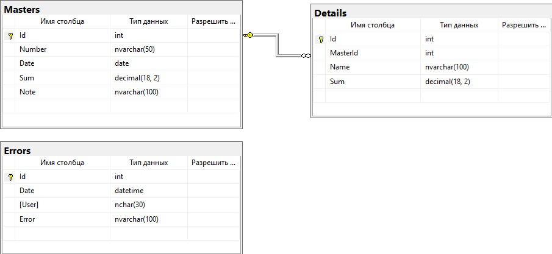
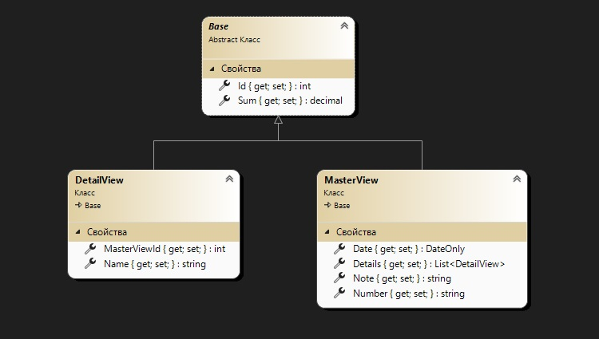
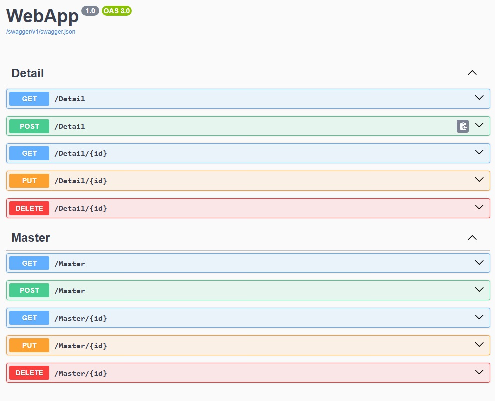
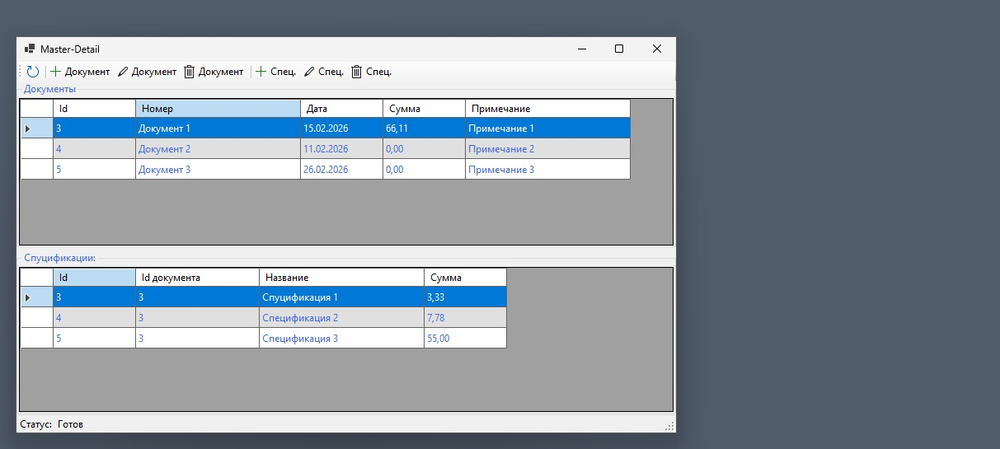
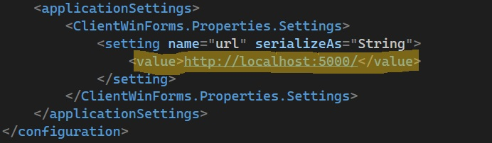
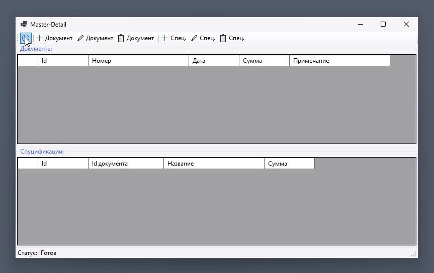

# Master-Detail

## Програмное обеспечение:
1. Windows 11 pro
2. [Visual Studio Enterprise 2022](https://visualstudio.microsoft.com/ru/vs/older-downloads/)
3. [Microsoft SQL Server Standard Developer (64-bit)](https://go.microsoft.com/fwlink/?linkid=2344711&clcid=0x409&culture=en-us&country=us)
4. [SQL Server Management Studio 22](https://aka.ms/ssms/22/release/vs_SSMS.exe)
5. [.NET 9.0](https://dotnet.microsoft.com/en-us/download/dotnet/9.0)

### База данных
Схема:  
  
Скрипты создания базы данных находятся в папке проекта "DB":  
	1. 1_CreateDB.sql (Создание базы данных)  
	2. 2_CreateUserServer (Создать имя входа на sql сервер).  
	3. 3_CreateRoleDB (Создать группу в бд Master-Detail).  
	4. 4_AddUserInRole (Создать прользователя бд и добавть его в группу бд)  
### Прилжение
#### Диаграммa классов сущностей БД:


#### Сервис:

#### Клиент:
C#,Windows forms

### Настройки проекта:

#### Подключение к базе данных: 
В файле ..\Master-Detail\Data\MasterDetailsContext.cs
Изменить строку подключения.

  
optionsBuilder.UseSqlServer(    
                *@"Data Source = DESKTOP-J5R38NF;  
Initial Catalog = MasterDetails1;  
Persist Security Info = False;  
User ID = user2;  
Password = 12345;  
Pooling = False;  
MultipleActiveResultSets = False;  
Encrypt = False;  
TrustServerCertificate = True;  
Command Timeout = 0"*  
);

#### Настройка веб сервиса:
В файле ..\Master-Detail\WebApp\Properties\launchSettings.json
Изменить параметр   
```"applicationUrl": "http://localhost:5000",```  
#### Настройка Клиента:
В файле ..\Master-Detail\ClientWinForms\App.config  


# ----------------------------------------------------------------------------------  
[]movi.mp4](https://github.com/kyury2017/Master-Detail/blob/master/movi.mp4)


